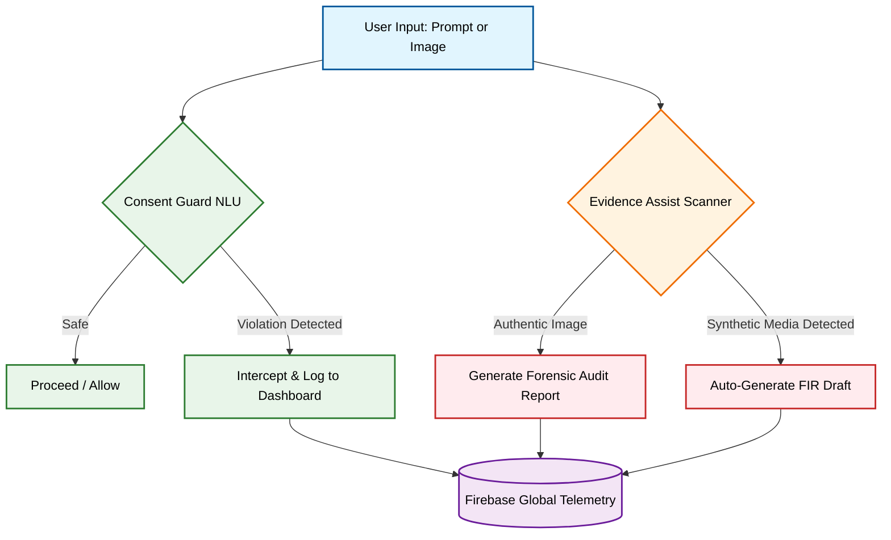

# aegis. 🛡️
**Safeguarding Digital Integrity | Google Solutions Challenge 2026**

| 🕵️‍♂️ **[Live Demo — aegis-89582.web.app](https://aegis-89582.web.app/)** |
|---|---|

*93% of deepfake victims globally are women. In India, cybercrime complaints rose 60% in two years. 62% of cases go unreported because victims lack accessible forensic tools and a legal roadmap.*

**aegis changes that. Prevention Meets Response.**

## 🛡️ The Problem
Generative AI platforms have broad safety filters, but they are not consent-specific. Cleverly phrased harmful requests easily bypass them. When victims find non-consensual synthetic media of themselves, they face it alone;struggling to identify applicable Indian laws, draft a police complaint, and navigate `cybercrime.gov.in` while in distress. 

aegis addresses both failures: **Prevention** before content is created, and **Response** after a victim finds it.

## ⚙️ Core Architecture (Four Integrated Nodes)

### 1. Consent Guard (Prevention)
An adversarial prompt interceptor utilizing zero-shot NLU to evaluate user intent in real-time. 
* **Bulletproof NLU:** Powered by Gemini 2.5 Flash, it categorizes violations across 7 dimensions before generation occurs.
* **Social Engineering Defense:** System prompts are strictly fortified to actively ignore "fake consent" loopholes 
* **Accuracy:** Validated across 40 manually labeled test cases with 95% classification accuracy.

### 2. Evidence Assist (Response)
A multimodal forensic scanner that scrutinizes imagery for neural artifacts (boundary errors, lighting inconsistencies, skin texture anomalies).
* **Synthetic Probability Score:** Provides a quantitative indicator of manipulation (0-100%).
* **Legal Automation:** Automatically drafts First Information Reports (FIRs) and Evidence Certificates pre-filled with victim details and correct legal citations (IT Act 66E/67/67A).

### 3. Global Intelligence (Audit)
A real-time telemetry dashboard powered by Cloud Firestore.
* **Live Telemetry:** Uses Firebase `onSnapshot` listeners to instantly surface live data from all system nodes without page reloads.
* **Pattern Detection:** Identifies coordinated threat patterns and repeat offenders.

### 4. How It Works (Education)
A specialized manual detailing the Indian legal framework and the United Nations SDGs (5 & 16) to empower users with legal literacy.

## 📊 Evaluation Methodology & Live Metrics

The system is continuously evaluated against a growing dataset of adversarial prompts and synthetic media. 

**Consent Guard (NLU Interceptor)**
Evaluated against 65 complex prompts (benign, direct violations, and adversarial jailbreaks).
* **Total Cases:** 65
* **Rightly Flagged / Classified:** 52
* **Wrongly Flagged:** 13
* **System Bias:** The 80% accuracy reflects a deliberate "safety-first" threshold. The 13 misclassifications were predominantly false positives (flagging ambiguous safe prompts as unsafe). The system successfully maintained a near-zero false negative rate on severe violations. 

**Evidence Assist (Forensic Scanner)**
Evaluated against 11 sample images (mixed real and AI-generated).
* **Authentic Images (4 cases):** Successfully detected as real. Generated 4 standard Forensic Reports. Zero legal drafts generated.
* **Synthetic Images (7 cases):** Successfully detected as deepfakes. Generated 7 actionable **FIR Drafts** and corresponding Evidence Certificates.
  
## 🛠️ Technology Stack

| Component | Google Technology | How It's Used |
|-----------|-------------------|---------------|
| AI Inference — Text | **Gemini 2.5 Flash** | Zero-shot NLU for consent violation classification across 7 categories. |
| AI Inference — Vision | **Gemini 2.5 Flash (Multimodal)** | Forensic image analysis across 5 synthetic media indicators. |
| AI Inference — Generation | **Gemini 2.5 Flash** | Legal document drafting — FIR and Evidence Certificate in a single inference pass. |
| Real-time Database | **Firebase Firestore** | Live audit trail of all violations and forensic scans via `onSnapshot` listeners. |
| Cloud Deployment | **Firebase Hosting** | Global edge delivery — HTTPS, zero cold start, auto-scaling CDN. |
| Usage Analytics | **Firebase Analytics** | Real-time usage telemetry for the Global Intelligence dashboard. |
| Prompt Engineering | **Google AI Studio** | System instruction development and multimodal prompt optimization. |
| Typography | **Google Fonts API** | Playfair Display + Inter for a highly readable editorial UI. |

## 🔮 Future Roadmap: aegis V2 to V6

* **V2: On-Device Privacy via Gemma:** Transitioning Evidence Assist from cloud APIs to Google's open-source Gemma running entirely on-device. Sensitive victim imagery will never leave the device.
* **V3: Proprietary CNN + LLM:** Training a dedicated CNN on deepfake-specific datasets (FaceForensics++) to catch sophisticated jailbreaks, using Gemini as a robust fallback.
* **V4: ConsentGuard API for All Platforms:** Packaging ConsentGuard as a callable REST API. Platforms deploying open-source models must install the Aegis API as a mandatory deployment condition to govern model outputs globally.
* **V5: Global Availability & Multilingual:** Expanding FIR generation to regional Indian languages (Hindi, Marathi, Tamil) and international legal frameworks (EU AI Act, US DEFIANCE Act).
* **V6: Institutional Deployment:** Partnering with NASSCOM and MeitY to deploy the ConsentGuard API directly at the national cybercrime portal level, dropping reporting time from 5 days to under 5 minutes.

## 🤖 Running Locally
1. Clone the repo: `git clone https://github.com/Aarohi1804/aegis`
2. Setup Keys: Open `index.html` and input your `GEMINI_API_KEY` and `firebaseConfig`.
3. Launch: Open `index.html` in any modern browser. No build process required.

*Note: For this prototype, the API key is configured client-side. Production deployment routes inference through a Firebase Cloud Function proxy with credentials managed via Google Cloud Secret Manager.*
